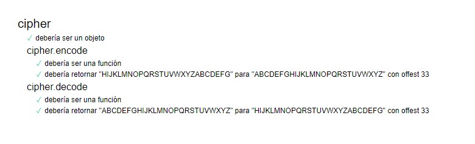

# SECRET RECIPE
SECRET RECIPE es una aplicación web que resultará útil tanto para el publico en general como para uso industrial. Debido a que nuestros usuarios tendran por primera vez la oportunidad de compartir sus recetas de manera incognita, al enviar sus formulas secretas en lenguaje cifrado ya no correrán el riesgo que sus obras maestras se divulgen con personas equivocadas.

### Definición del Producto

* Público Objetivo:

  - Todas las personas que tienen interes en compartir sus recetas de forma secreta, asi sea por tradicion familiar o por confidencialidad corporativa.

    

* Cuáles son los objetivos de estos usuarios en relación con tu producto.

  - Compartir las recetas solo con quienes deseen mediante un mensaje cifrado sin temor a que pueda ser filtrado, nadie podra recuperar la receta sin la clave secreta.

      

* ¿Cómo crees que el producto que estás creando está resolviendo sus problemas?

  - Protegiendo la confidencialidad de su informacion.
  - Se sentiran seguros de compartir sus recetas.

### Instrucciones de uso
  Para acceder a la aplicación web "Secret Recipe" se tiene que seguir el siguiente link:

  "https://gloryrojas.github.io/lim-2018-11-bc-core-am-cipher/src/"

  La página tiene una interfaz sencilla y de fácil uso con una pantalla para todas las acciones, lo que el usuario tendría que hacer es:
* Abrir la página
* En el primer recuadro digitar la receta que desea codificar.
* En el segundo recuadro indicar la clave secreta en numeros.
* Dar click en el botón respecto a la acción que desea realizar.
* Tendra el resultado deseado en el recuadro final.

### Decisiones de Diseño

Se había pensado inicialmente en realizar tres pantallas distintas, por consideraciones y recomendaciones de usuarios potenciales se opto por una sola en la que se incluyan todas las acciones.

### Consideraciones Técnicas
* SECRET RECIPE, pasó todas las pruebas test unitarios.

    
*
